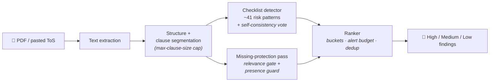

<div align="center">

# Terms & Conditions Risk Analyzer

**Upload a Terms of Service or Privacy Policy → get back the clauses that actually disadvantage you** — each with a severity, a risk category, and a plain-English explanation — plus the consumer protections the document is *missing*.


</div>

> The interesting part of this project isn't the app; it's the **detection engineering and the evaluation harness that measures it**. Most "AI reads your ToS" demos are a single open-ended prompt. This one is built around measured insights about where LLMs are reliable and where they aren't — and an eval harness rigorous enough that it caught and corrected *its own* measurement bugs.

---

## Contents

- [What makes it interesting](#what-makes-it-interesting)
  - [Insight 1 — checklist beats open-ended](#insight-1--checklist-beats-open-ended)
  - [Insight 2 — chunking is the recall lever](#insight-2--chunking-is-the-recall-lever)
- [How detection works](#how-detection-works)
- [The evaluation harness](#the-evaluation-harness)
- [Benchmark results](#benchmark-results-honest)
- [Tech stack](#tech-stack)
- [Getting started](#getting-started)
- [Testing](#testing)
- [Project structure](#project-structure)
- [Design notes](#design-notes)

---

## What makes it interesting

### Insight 1 — checklist beats open-ended

The first version asked the model an open-ended question — *"find the risky clauses in this document."* On a real TikTok ToS it surfaced **1** HIGH-severity clause and missed 5 of the 6 known-critical ones.

The fix was to reframe detection as **matching, not searching**: instead of one open-ended ask, the detector runs a *checklist* — "for each of these ~41 curated risk patterns, is it present?" Same model, same document — but HIGH-severity recall went from **1 → 8**.

> **LLMs are reliable matchers and unreliable exhaustive searchers.**

A corollary that kept biting: **severity must track consumer *harm*, not industry *prevalence*.** A "calibration rule" that quietly downgraded common-but-severe clauses survived in secondary voting prompts long after it left the main rubric. Auditing recall means auditing *every* prompt layer, not just the rubric.

### Insight 2 — chunking is the recall lever

If the checklist is the matcher, **clause segmentation decides whether the matcher even gets a fair shot.** Real ToS are messy: one document (Apple Media Services) arrives as a single unbroken **8,300-word line**, which the parser collapsed into *one giant clause*.

The checklist then had to exhaustively scan a wall of text — the exact thing LLMs do unreliably — and silently missed clauses buried mid-document (law-enforcement disclosure, sole-remedy, a perpetual license).

Enforcing a maximum clause size took that document from **1 → 49 clauses**, and the missed findings came back. Clause size sits in a Goldilocks band: too coarse → buried clauses are missed and distinct risks collide; too fine → a single risk gets split across fragments. This is the single biggest non-prompt quality lever in the system.

---

## How detection works



Three stages, each deliberately simple and inspectable:

1. **Risky-clause detection** (`llm_clause_detector.py`, checklist mode) — matches the document against ~41 curated patterns in `risk_patterns.py` (perpetual content licenses, forced arbitration + class waivers, termination-on-suspicion, cascading family payments, …). Optional self-consistency voting (3 independent severity votes) stabilizes borderline calls.
2. **Missing-protection detection** (`expected_protections.py`) — flags protections a fair agreement *should* contain but doesn't (breach notification, advance-notice of changes, termination appeals, …), behind a **relevance gate** (don't flag arbitration-opt-out on a doc with no arbitration) and a **presence guard** (don't flag "no advance notice" when the doc literally says "30 days before changes").
3. **Ranking & bucketing** (`alert_ranker.py`) — scores findings, buckets into high / medium / low, applies a recall-first alert budget (HIGH/MEDIUM are never silently dropped), and deduplicates findings that describe the same risk in the same clause.

Upstream, a **document pipeline** turns a raw upload into clauses: text extraction → structure extraction → clause segmentation (the recall lever above).

---

## The evaluation harness

Detection quality on a subjective task is meaningless without measurement you can't fool. `backend/evals/` is built for that — and the most valuable thing in it is that **the harness diagnosed and corrected its own measurement bugs**:

| The harness caught… | …and the fix |
| --- | --- |
| **A metric lie** — headline "severity κ +0.07" looked like failure | It was the *kappa base-rate paradox* (both sides concentrate on "medium" → unweighted κ collapses despite 55% raw agreement). Switched the headline to **quadratic-weighted kappa + MAE**. |
| **A label bug** — the benchmark's "gold" severity was assigned *by category, not by reading the clause* | Severity on that set is unmeasurable regardless of metric — **documented, not buried.** |
| **An unmeasurable claim** — the public set was positives-only, so "100% recall" was vacuous | Added fair negatives → a real **false-positive rate**; every headline now carries a **bootstrap confidence interval**. |

<details>
<summary><b>Other guardrails</b> (sealed holdout · CI gate · ablation · no hand-typed numbers)</summary>

<br/>

- **Sealed gold holdout** — 149 hand-labeled clauses behind an import firewall + CI grep gate, so numbers can't be gamed by leakage. (Automated relabeling of this set is explicitly forbidden — the candidate-finder is read-only, since machine-relabeling the gold standard with the detector's own heuristics would make the benchmark circular.)
- **CI regression gate** — fails the build on κ/QWK drift. Per-severity kappa returns *undefined* (not a fake `1.0`) for zero-support classes, so a class that later gains instances can't masquerade as a regression.
- **Ablation harness** — self-consistency voting was *kept* because it gave +0.06 κ at \$0 cost, not on a hunch.
- **No hand-typed numbers** — every figure in the reports is generated by a script from a JSON run artifact.

</details>

### Benchmark results (honest)

| Benchmark | Result |
| --- | --- |
| **UNFAIR-ToS (LexGLUE)**, mixed set, N=180, 95% CIs | **84.1% recall** [74.6–92.5] at a **4.3% false-positive rate** [0.9–8.3]; category recall 54% |
| **Cross-family agreement** vs Gemini 2.5 Flash (independent model, same rubric, N=30) | severity κ **+0.419 (moderate)**, category κ +0.531, joint 60% |

Honest framing: *credibly competitive, not state-of-the-art.* Severity on UNFAIR-ToS is **not** quoted as a quality number — its labels are a category proxy. Full write-ups: [`backend/evals/BENCHMARK.md`](backend/evals/BENCHMARK.md), [`backend/evals/COMPARATIVE_REPORT.md`](backend/evals/COMPARATIVE_REPORT.md), and the prioritized [`BENCHMARK_IMPROVEMENT_PLAN.md`](backend/evals/BENCHMARK_IMPROVEMENT_PLAN.md).

---

## Tech stack

**Backend** — FastAPI · SQLAlchemy 2.0 · Pydantic v2 · PostgreSQL (Supabase) · Anthropic Claude API · Pinecone + embeddings (powers a separate document Q&A feature, not detection) · pytest

**Frontend** — React + Vite · TanStack Query · React Hook Form · Radix UI · Tailwind CSS

---

## Getting started

<details>
<summary><b>Prerequisites & run commands</b></summary>

<br/>

**Prerequisites:** Python 3.9+, Node 18+, an Anthropic API key (required for detection), and a PostgreSQL database (Supabase works out of the box).

```bash
# Backend
cd backend
python -m venv venv && source venv/bin/activate
pip install -r requirements.txt
cp .env.example .env            # fill in ANTHROPIC_API_KEY, DATABASE_URL, …
uvicorn app.main:app --reload --port 8000     # API docs at /api/v1/docs

# Frontend
cd frontend
npm install
npm run dev                     # http://localhost:5173
```

> **Supabase note:** the direct-connection host (`db.<ref>.supabase.co`) is IPv6-only. On an IPv4-only network, point `DATABASE_URL` at the **Supavisor session pooler** (`aws-…​.pooler.supabase.com:5432`, user `postgres.<ref>`).

</details>

---

## Testing

<details>
<summary><b>Test + benchmark-reproduction commands</b></summary>

<br/>

```bash
cd backend
python -m pytest tests/          # unit + integration (integration skips cleanly offline)
python -m pytest evals/tests/    # eval-metric unit tests (no API calls)
```

Reproduce the benchmarks (needs `ANTHROPIC_API_KEY`, optionally `GEMINI_API_KEY`):

```bash
python -m evals.run_unfair_tos_benchmark --dataset unfair_tos_mixed --n 180 --chunk 30 \
    --out evals/unfair_tos_mixed_benchmark.json
python -m evals.run_gemini_agreement --n 30 --out evals/gemini_agreement_run.json
```

</details>

---

## Project structure

<details>
<summary><b>Directory layout & where detection lives</b></summary>

<br/>

```
backend/
  app/
    api/v1/          # FastAPI routes (upload, anomalies, auth, query, compare)
    core/            # detection + document pipeline (see below)
    services/        # Claude, cache, embeddings + Pinecone (Q&A retrieval)
  evals/             # evaluation harness, gold holdout, benchmarks, reports
  tests/             # unit + integration tests
frontend/src/        # React app (upload, results, comparison dashboard, Q&A)
data/baseline_corpus # 30+ reference ToS documents
```

Detection lives in `backend/app/core/`:
`llm_clause_detector.py` · `risk_patterns.py` (~41 patterns) · `expected_protections.py` (13 protections) · `alert_ranker.py` · `anomaly_detector.py` (orchestrator) · `structure_extractor.py` (clause segmentation).

</details>

---

## Design notes

<details>
<summary><b>Decisions that are easy to miss from the code alone</b></summary>

<br/>

- **Deletion over abstraction.** An earlier 6-stage pipeline was measured against a benchmark, shown to be net-subtractive, and removed — `anomaly_detector.py` went from ~2,500 LOC to ~215 (~17K LOC deleted across the refactor).
- **Inverted-logic protections are excluded.** "Absence is good" protections (e.g. *moral rights preserved*) don't fit a present/absent model and fired as false positives on nearly every document.
- **Recall-first ranking.** Suppressed alerts aren't surfaced downstream, so the ranker never trims HIGH/MEDIUM findings — only LOW, and only over budget.
- **Fail loud, not silent.** A *total* LLM detection failure raises (and the document is marked failed) rather than returning zero findings — a false "no risks found" is the worst outcome for a risk tool.
- **The benchmarks don't test chunking.** They feed isolated single clauses, so the clause-segmentation lever is measured only end-to-end (document level) — a known gap tracked in the improvement plan.
- **Detection is pure-LLM; embeddings/Pinecone serve a different feature.** The vector store powers a semantic Q&A tab (ask questions about an uploaded document), *not* anomaly detection — verified before any cleanup, and kept deliberately.

</details>
